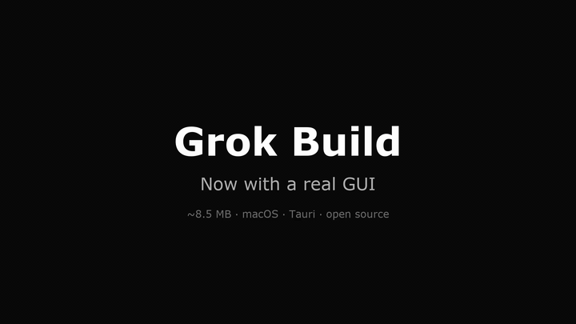

# Grok GUI

> **A native desktop GUI for the [Grok Build](https://github.com/xai-org/grok-build) coding agent.**
> Codex-style sidebar, multi-session parallel, multi-provider, Ask / Plan / Build sandbox modes.



[](https://github.com/timexingxin/grok-gui/actions/workflows/ci.yml)
[](https://github.com/timexingxin/grok-gui/releases/latest)
[](./LICENSE)
[](https://tauri.app)

## Install

| Platform | Command |
|---|---|
| **macOS / Linux (Homebrew)** | `brew install --cask timexingxin/grok-gui/grok-gui-lite` |
| **macOS (DMG, drag-install)** | Download `Grok GUI Lite-0.1.0-{Apple-Silicon,Intel}.dmg` from [releases](https://github.com/timexingxin/grok-gui/releases/latest) |
| **Windows (NSIS installer)** | Download `Grok GUI Lite_0.1.0_x64-setup.exe` from [releases](https://github.com/timexingxin/grok-gui/releases/latest) |
| **From source (dev)** | `npm install && npm run tauri:dev` (Node 20+, Rust 1.77+) |

The first launch will offer a one-line installer for the [Grok Build CLI](https://x.ai) if it isn't on `PATH`:

```bash
curl -fsSL https://x.ai/cli/install.sh | bash
```

## What it is

`grok-build` is open-source (Apache-2.0) but ships as a Rust TUI. **Grok GUI wraps that TUI in a real desktop shell** — same client/server split OpenCode uses, but with a Codex-style native UX instead of a terminal. The Rust side spawns `grok agent stdio` as a child process, talks ACP/JSON-RPC 2.0 over its stdin/stdout, and streams every event (text deltas, tool calls, plan updates, permissions) into the React frontend.

## Features

- **Multi-session parallel** — run several conversations in parallel; switch without interrupting the running turn. The Rust side keeps a pool of live runtimes (LRU-evicted, idle-only) so background turns keep streaming.
- **Two auth paths** — sign in with your `grok.com` OAuth account, or paste an xAI / OpenAI-compatible API key. The model picker shows the right catalogue for each.
- **Multi-provider** — xAI, OpenAI, Anthropic, Google, DeepSeek, OpenRouter, Ollama, and any OpenAI-compatible endpoint. Picker swaps the env when you switch.
- **Ask / Plan / Build sandbox modes** — mapped to Grok's three sandboxes. Read-only → read-only + no shell → full access. Changes restart the agent so sandbox policy always matches the picker.
- **Tool-call cards, plan view, workspace browser, transcripts** — the whole agent event surface rendered in a real GUI, not a terminal.
- **Live token / cost / context-window** in the topbar.
- **In-message ⋮ menu** — edit/quote-resend, interrupt-and-send, delete. Queued messages sit in an inline card above the composer.
- **First-run language picker** — English / 简体中文. The picker's choice is forwarded to the agent runtime via `LANG`/`LC_ALL` so the agent speaks the same language as the UI (override-able per-workspace via `AGENTS.md`).

## How it compares

| | Grok GUI | Cursor | Claude Code | Continue.dev | Cody |
|---|---|---|---|---|---|
| **Open source** | MIT | No | No | Apache-2.0 | Freemium |
| **Native desktop GUI** | Tauri 2 (~8 MB) / Electron (~150 MB) | Electron | Terminal + VS Code | VS Code only | IDE plugin |
| **Model-agnostic** | xAI + OpenAI + Anthropic + Google + DeepSeek + OpenRouter + Ollama | OpenAI + Anthropic + custom | Anthropic only | Many | Many |
| **Multi-session parallel** | Yes | Per-workspace | No | No | No |
| **Permission modes (Ask/Plan/Build)** | Yes | Implicit | Yes | No | No |
| **Underlying agent** | [grok-build](https://github.com/xai-org/grok-build) (xAI's, Rust TUI) | Proprietary | Anthropic's CLI | VS Code LLM protocol | Sourcegraph |

## Architecture

```
┌──────────────────────────────────────────┐
│  Desktop Shell (Tauri 2)                 │   ← this repo (React + Vite + Tailwind)
│  Zustand state, markdown rendering       │
└──────────────┬───────────────────────────┘
               │ Tauri commands + events (typed)
               ▼
┌──────────────────────────────────────────┐
│  Rust bridge (apps/desktop/src-tauri)    │   ← this repo
│  - spawns `grok` CLI as child process    │
│  - JSON-RPC 2.0 over stdio (ACP)         │
│  - LANG/LC_ALL forwarded for agent locale│
└──────────────┬───────────────────────────┘
               │ subprocess stdin/stdout
               ▼
┌──────────────────────────────────────────┐
│  Grok Build runtime (xai-org/grok-build) │   ← upstream, Apache-2.0
│  Agent loop, tools, context, MCP, skills │
└──────────────────────────────────────────┘
```

## Inspiration

| Reference | What we borrowed |
|---|---|
| [OpenCode](https://github.com/sst/opencode) | Client-server architecture, multi-provider registry, event-driven design |
| [Codex](https://github.com/openai/codex) | macOS-style sidebar + composer, token / cost display, first-run picker |
| [DeepSeek GUI](https://github.com/KunAgent/Kun) (formerly XingYu-Zhong/DeepSeek-GUI) | Mode tabs (Code/Write), project pinning |
| [xai-org/grok-build](https://github.com/xai-org/grok-build) | The actual agent runtime (Rust TUI) we wrap |

## Repo layout

```
grok-gui/
├── apps/desktop/                 Tauri 2 app (Rust + React)
│   ├── src/                      React frontend (Sidebar, ChatArea, InputBar, ...)
│   ├── src-tauri/                Rust side (grok_runtime, tauri commands)
│   └── scripts/afterSign.js      macOS-only re-sign hook
├── electron-version/             Electron build (alternative runtime)
│   └── electron/grok-runtime.ts   Node.js equivalent of Tauri runtime
├── packages/
│   ├── ui/                       Shared React components
│   ├── core/                     Types, Zustand store, utils
│   ├── provider/                 Provider catalog (models.dev integration)
│   └── acp-bridge/               JSON-RPC 2.0 client for Grok Build
├── packaging/homebrew/Casks/     brew install --cask source
└── docs/                          demo frames, screenshots
```

## Known limitations

- **Ad-hoc signing on macOS.** DMGs use the `-` identity (no Apple Developer ID yet). First install triggers the Gatekeeper "unidentified developer" prompt — right-click the app → Open to bypass. We're working on either an ad-hoc-signing-aware onboarding script or a real Developer ID.
- **xAI does not accept external PRs** to `grok-build`. This GUI is the layer where you can iterate freely. If upstream deletes the repo, Apache-2.0 still gives you the right to fork.
- **Upstream data-handling concerns** have been documented about `grok-build`. The Rust side here only spawns the process with explicit args; **we add no extra network calls.** Audit upstream's `crates/runtime/` before running on real code.

## Contributing

See [CONTRIBUTING.md](./CONTRIBUTING.md) for dev setup, test commands, and the release flow. Bug reports and PRs are welcome; for security issues see [SECURITY.md](./SECURITY.md).

## License

[MIT](./LICENSE) for this repo. The wrapped `grok-build` runtime is Apache-2.0 from [xai-org/grok-build](https://github.com/xai-org/grok-build).
